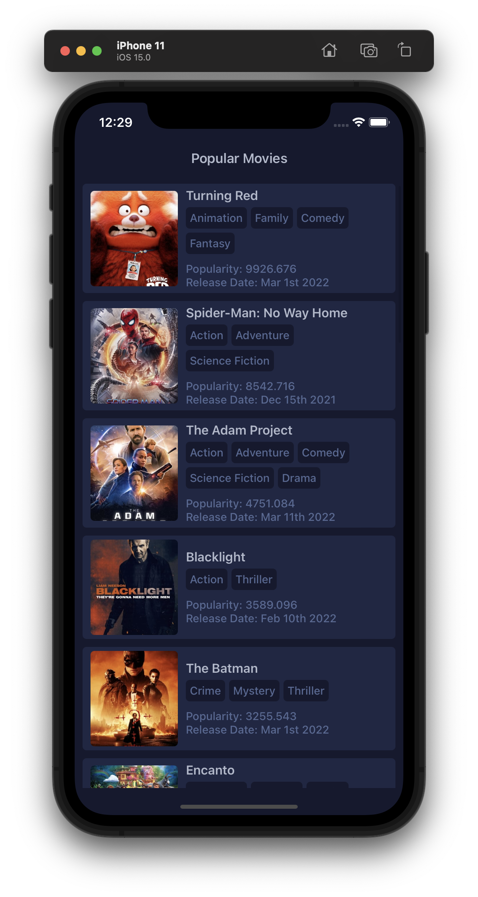
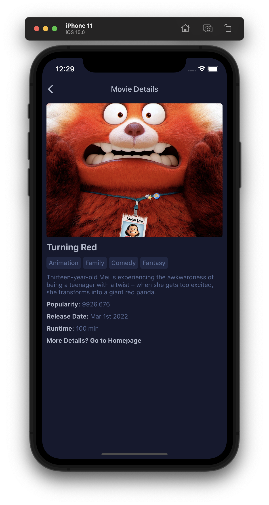

# theMovie (used themoviedb API)

## Install

Follow installation of [React-Native CLI QuickStart](https://reactnative.dev/docs/getting-started)

```
brew install yarn
brew install node
brew install watchman
brew tap AdoptOpenJDK/openjdk
brew cask install adoptopenjdk8

npm install -g react-native-cli

1. Install Android Studio
2. Install the Android SDK
3. Configure the ANDROID_HOME environment variable
```

### iOS

```
npm install
npx react-native start
cd ios && pod install
cd .. & npx react-native run-ios
```

### Android

```
npx react-native start
npx react-native run-android
```

## Screenshots

### Home

### Detail
